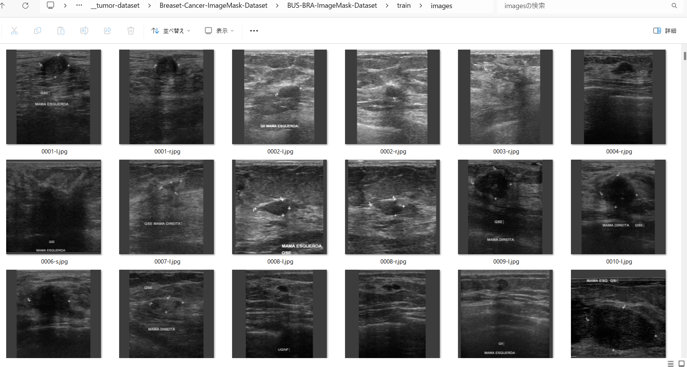
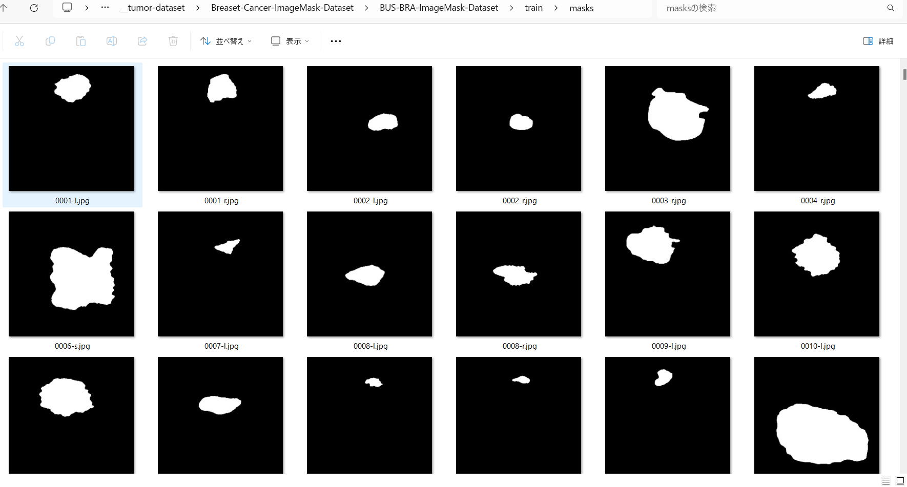

<h2>BUS-BRA-ImageMask-Dataset (2024/02/24)</h2>
This is a BUS-BRA(Breast-Cancer) ImageMask Dataset for Image Segmentation.   
 
<h3>1. Dataset Citatioin</h3>
The orginal BUS-BRA dataset used here has been taken from the following web site. 
<a href="https://zenodo.org/records/8231412"><b>BUS-BRA: A Breast Ultrasound Dataset for Assessing Computer-aided Diagnosis Systems</b>
</a>
 
Wilfrido Gómez-Flores, Maria Julia Gregorio-Calas, 
Wagner Coelho de Albuquerque Pereira 

<pre>
The BUS-BRA Dataset is a publicly available dataset of anonymized breast ultrasound (BUS) images of 1,064 patients 
that underwent routinary breast studies. The BUS dataset contains biopsy-proven tumor cases and BI-RADS annotations 
in categories 2, 3, 4, and 5. In addition, the dataset also contains ground truth delineations that divide the BUS 
images into tumoral and normal regions. A full description of the BUS-BRA dataset can be found in the following article:

Wilfrido Gómez-Flores, Maria Julia Gregorio-Calas, and Wagner Coelho de Albuquerque Pereira, 
"BUS-BRA: A Breast Ultrasound Dataset for Assessing Computer-aided Diagnosis Systems," Medical Physics, 2023. (In revision)

Any research originating from its usage is required to cite this paper.

The Program of Biomedical Engineering of the Federal University of Rio de Janeiro (PEB/COPPE-UFRJ, Brazil) has a copyright 
on the data and is the principal distributor of the BUS-BRA Dataset. In addition, the Centro de Investigación y de Estudios
 Avanzados (Cinvestav, Mexico) is involved in an ongoing effort to develop this dataset to aid research efforts in developing, 
 testing, and evaluating algorithms for breast ultrasound analysis.
</pre>

<h3>
2. Download master dataset
</h3>
Please download master dataset from the following web site. 
<a href="https://zenodo.org/records/8231412"><b>BUS-BRA: A Breast Ultrasound Dataset for Assessing Computer-aided Diagnosis Systems</b>
</a>

The dataset has the following folder structure. 
<pre>
./BUSBRA
├─Images
└─Mask
</pre>
Image folder contains 1875 bus_*.png files, and Mask coressponding 1875 mask_*.png files respectively.
3. Create ImageMask Dataset
</h3>
<h3>
3.1 Create master dataset
</h3>
Please run Python script <a href="./generator/ImageMaskDatasetGenerator.py">ImageMaskDatasetGenerator.py</a>.
to create jpg image and mask files. 
<pre>
>python ImageMaskDatasetGenerator.py
</pre>
This script performs the following image processings. 
<pre>
1 Create 512x512 square masks from the original mask_*.png files in <b>Masks</b> folder. 

2 Create 512x512 square images corresponding to the mask files from the original bus_*.png files in <b>Images</b> folder
</pre>
The created <b>BUS-BRA-master</b> dataset has the following folder structure. 

<pre>
./BUSBRA-master
  ├─images
  └─masks
</pre>

<h3>
3.2 Split master dataset to test, train and valid 
</h3>
By using Python script <a href="./generator/split_master.py">split_master.py</a>,
 we have finally created <b>BUS-BRA-ImageMask-Dataset</b> dataset from the <b>/BUS-BRA-master</b>. 
<pre>
./BUS-BRA-ImageMask-Dataset
├─test
│  ├─images
│  └─masks
├─train
│  ├─images
│  └─masks
└─valid
    ├─images
    └─masks
</pre>

<b>train/images samples:</b> 

 
<b>train/masks samples:</b> 

 
 

You can download the latest dataset from the google drive 
<a href="https://drive.google.com/file/d/1SafNtMgHlr_0fludiIxpaRNqwA7muQKr/view?usp=sharing">
BUS-BRA-ImageMask-Dataset.zip</a>.

